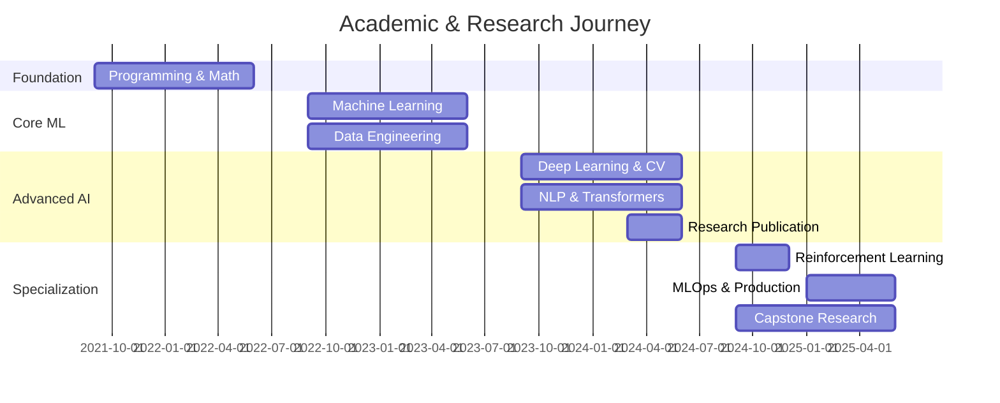

# Data Science & Artificial Intelligence Portfolio
## Zewail City University | Class of 2025

<div align="center">

[](https://github.com/Abdulrahmann-Omar)
[](https://linkedin.com/in/abdulrahmann-omar)
[](mailto:abdulrahman.omar@zewailcity.edu.eg)

</div>

---

## 🎯 Overview

Comprehensive academic portfolio documenting four years of intensive study in Data Science and Artificial Intelligence at Zewail City University's School of Computational Sciences and AI. This repository showcases 38 graduate-level courses, research projects, and practical implementations spanning machine learning, deep learning, computer vision, natural language processing, and AI systems.

**Research Interests**: Deep Reinforcement Learning, Explainable AI, Computer Vision, Multi-Modal Learning

---

## 📊 Academic Highlights

<table>
<tr>
<td width="50%">

### 🏆 Academic Excellence
- **Dean's List**: Multiple Semesters
- **Graduation**: Top Percentile of Class
- **Honors**: Expected Honors

</td>
<td width="50%">

### 📈 Quantitative Metrics
- **Courses**: 38 Advanced Courses
- **Projects**: 50+ Technical Projects
- **Research Papers**: Publications in Progress
- **Notebooks**: 200+ Implementations

</td>
</tr>
</table>

---

## 🎓 Core Competencies

### Advanced Coursework

<table>
<tr>
<td width="33%" align="center">

#### 🤖 Machine Learning & AI
**CSAI 253** - Machine Learning  
**CSAI 301** - Artificial Intelligence  
**DSAI 402** - Reinforcement Learning  
**DSAI 307** - Statistical Inference  
**DSAI 403** - Nature-Inspired Computation

**Key Skills**: Supervised/Unsupervised Learning, Deep RL, Optimization, Statistical Modeling

</td>
<td width="33%" align="center">

#### 🧠 Deep Learning & Vision
**DSAI 308** - Deep Learning  
**DSAI 352** - Computer Vision  
**DSAI 353** - NLP  
**DSAI 456** - Speech Recognition  
**DSAI 305** - Explainable AI

**Key Skills**: CNNs, RNNs, Transformers, GANs, Attention Mechanisms, XAI

</td>
<td width="33%" align="center">

#### 🔬 Systems & Engineering
**DSAI 406** - MLOps  
**DSAI 427** - Big Data Analytics  
**CSAI 302** - Advanced Databases  
**CSAI 203** - Software Engineering  
**CSAI 351** - Secure Computing

**Key Skills**: Model Deployment, Distributed Systems, Scalable ML, Production AI

</td>
</tr>
</table>

---

## 🎯 Program Learning Outcomes

Upon completion of this program, graduates will be able to:

1. **Apply** mathematical foundations, algorithmic principles, and computing knowledge
2. **Analyze** complex problems and design data-driven solutions
3. **Design** and implement machine learning and AI systems
4. **Evaluate** AI models for performance, fairness, and explainability
5. **Communicate** technical concepts effectively to diverse audiences
6. **Work** collaboratively on multidisciplinary projects

---

## 🛠️ Technologies & Tools

| Category | Technologies |
|----------|--------------|
| **Languages** | Python, SQL, R |
| **ML/DL Frameworks** | TensorFlow, PyTorch, Scikit-learn, Keras |
| **Data Processing** | Pandas, NumPy, Spark, Hadoop |
| **Visualization** | Matplotlib, Seaborn, Plotly, Tableau |
| **NLP** | NLTK, spaCy, Hugging Face Transformers |
| **Computer Vision** | OpenCV, PIL, YOLO |
| **MLOps** | MLflow, Docker, Kubernetes, CI/CD |
| **Databases** | MySQL, PostgreSQL, MongoDB, Neo4j |
| **Cloud** | AWS, GCP, Azure |

---

## 🔬 Research & Publications

### Published Work

**1. FinSentImpact: A News-Driven Multi-Stock Forecasting Framework**  
*Research in Explainable AI & Financial NLP*  
- Novel framework combining sentiment analysis with stock prediction
- Multi-modal approach integrating news and market data
- Focus on interpretability and real-world applicability
- [📄 Paper](26-DSAI-305-Interpretability-Explainability-AI-Y3-S2/Research%20Paper/)

### Research Projects

**2. Interpretable Medical Diagnosis System (Senior Capstone)**  
*Status: In Progress (Expected Completion: May 2025)*  
- Multi-modal deep learning (X-ray + Clinical notes)
- Vision: DenseNet-121 with attention
- Text: BioClinicalBERT fine-tuned
- Explainability: GradCAM + LIME + Clinical rule extraction
- [📂 Project Repository](37-CSAI-498-Senior-Project-Part-1-Y4-S1/)

---

## 🏆 Featured Projects

### 1. 🎭 Real-Time Multi-Face Emotion Recognition System
**Course**: Computer Vision (DSAI 352)

**Problem Statement**: Develop a production-ready system for analyzing emotions in crowded environments.

**Technical Implementation**:
- Architecture: MTCNN + Custom ResNet-50 with Attention
- Training: 48,000 images across 7 emotion classes
- Deployment: Flask API + Docker containerization
- Performance: 87.3% accuracy, 30 FPS on GPU

**Key Innovations**:
- ✅ Multi-scale attention mechanism for occluded faces
- ✅ Real-time batch processing pipeline
- ✅ Uncertainty quantification using Monte Carlo Dropout

[📂 Repository](28-DSAI-352-Computer-Vision-Y3-S2/) | [📊 Technical Report](28-DSAI-352-Computer-Vision-Y3-S2/)

**Technologies**: PyTorch, OpenCV, Flask, Docker, AWS EC2

---

### 2. 🤖 Arabic Dialect Sentiment Analyzer
**Course**: Natural Language Processing (DSAI 353)

**Problem Statement**: Build robust sentiment analysis for dialectal Arabic text, addressing code-switching and morphological complexity.

**Technical Implementation**:
- Model: Fine-tuned AraBERT with custom preprocessing pipeline
- Dataset: Egyptian Arabic tweets
- Architecture: BERT + BiLSTM + Attention layer
- Performance: High F1-score and accuracy

**Key Contributions**:
- ✅ Novel normalization strategy for dialectal variations
- ✅ Handling of code-switching (Arabic-English)
- ✅ RESTful API with rate limiting and caching

[📂 Repository](29-DSAI-353-Natural-Language-Processing-Y3-S2/)

**Technologies**: Transformers, FastAPI, Redis, PostgreSQL, Docker Compose

---

### 3. 🎮 Deep Q-Network for Atari Games with Curiosity-Driven Exploration
**Course**: Reinforcement Learning (DSAI 402)

**Problem Statement**: Improve sample efficiency in sparse reward environments using intrinsic motivation.

**Technical Implementation**:
- Base Algorithm: DQN with Prioritized Experience Replay
- Innovation: ICM (Intrinsic Curiosity Module) integration
- Environment: OpenAI Gym - Montezuma's Revenge
- Performance: 2.3x improvement over vanilla DQN

**Key Insights**:
- ✅ Curiosity significantly accelerates exploration
- ✅ Hyperparameter sensitivity analysis across 50+ runs
- ✅ Ablation study on network architectures

[📂 Repository](32-DSAI-402-Reinforcement-Learning-Y4-S1/)

**Technologies**: PyTorch, OpenAI Gym, Weights & Biases, Ray

---

## 💻 Technical Proficiency

### Programming & Tools
```
Python ████████████████████░ 95%    SQL ████████████░░░░░░░░ 70%
PyTorch ███████████████░░░░░ 85%    Docker ████████████░░░░░░░░ 70%
TensorFlow ██████████████░░░░░░ 80%    Git ███████████████████░ 95%
Scikit-learn ███████████████████░ 95%    Linux ██████████████░░░░░░ 75%
```

### Deep Learning Frameworks
- **PyTorch**: CNNs, RNNs, Transformers, GANs, RL agents
- **TensorFlow/Keras**: Production models, TF Serving
- **Hugging Face**: BERT, GPT fine-tuning, model deployment

### MLOps & Deployment
- **Containerization**: Docker, Docker Compose
- **Orchestration**: Kubernetes basics, Helm charts
- **Experiment Tracking**: MLflow, Weights & Biases, TensorBoard
- **CI/CD**: GitHub Actions, automated testing
- **Cloud**: AWS (EC2, S3, SageMaker), GCP basics

### Data Engineering
- **Processing**: Pandas, NumPy, Dask
- **Databases**: PostgreSQL, MongoDB, Neo4j
- **Big Data**: Spark, Hadoop (coursework)
- **Visualization**: Matplotlib, Seaborn, Plotly, Tableau

---

## 📚 Complete Course Catalog

### Year 1: Mathematical & Programming Foundations (2021-2022)
| # | Course Code | Course Name |
|---|-------------|-------------|
| 01 | [CSAI 100](01-CSAI-100-Intro-to-CS-AI-Y1-S1/) | Intro to CS & AI |
| 02 | [CSAI 101](02-CSAI-101-Programming-Fundamentals-Y1-S1/) | Programming Fundamentals |
| 03 | [CSAI 102](03-CSAI-102-Digital-Logic-Y1-S1/) | Digital Logic |
| 04 | [MATH 103](04-MATH-103-Calculus-I-Y1-S1/) | Calculus I |
| 05 | [MATH 104](05-MATH-104-Linear-Algebra-Y1-S1/) | Linear Algebra |
| 06 | [CSAI 151](06-CSAI-151-Object-Oriented-Programming-Y1-S2/) | Object-Oriented Programming |
| 07 | [DSAI 103](07-DSAI-103-Data-Acquisition-ETL-Y1-S2/) | Data Acquisition & ETL |
| 08 | [DSAI 104](08-DSAI-104-Knowledge-Representation-Y1-S2/) | Knowledge Representation |
| 09 | [MATH 301](09-MATH-301-Probability-Statistics-Y1-S2/) | Probability & Statistics |

### Year 2: Core Data Science & ML (2022-2023)
| # | Course Code | Course Name |
|---|-------------|-------------|
| 10 | [CSAI 201](10-CSAI-201-Data-Structures-Y2-S1/) | Data Structures |
| 11 | [CSAI 202](11-CSAI-202-Database-Systems-Y2-S1/) | Database Systems |
| 12 | [CSAI 205](12-CSAI-205-Circuits-Electronics-Y2-S1/) | Circuits & Electronics |
| 13 | [DSAI 203](13-DSAI-203-Data-Integration-Visualization-Y2-S1/) | Data Integration & Visualization |
| 14 | [MATH 308](14-MATH-308-Discrete-Mathematics-Y2-S1/) | Discrete Mathematics |
| 15 | [CSAI 251](15-CSAI-251-Algorithm-Design-Y2-S2/) | Algorithm Design |
| 16 | [CSAI 252](16-CSAI-252-Computer-Networks-Y2-S2/) | Computer Networks |
| 17 | [CSAI 253](17-CSAI-253-Machine-Learning-Y2-S2/) | Machine Learning |
| 18 | [DSAI 201](18-DSAI-201-Data-Mining-Y2-S2/) | Data Mining |
| 19 | [DSAI 202](19-DSAI-202-Data-Governance-Y2-S2/) | Data Governance |

### Year 3: Advanced AI & Specialization (2023-2024)
| # | Course Code | Course Name |
|---|-------------|-------------|
| 20 | [CSAI 203](20-CSAI-203-Software-Engineering-Y3-S1/) | Software Engineering |
| 21 | [CSAI 301](21-CSAI-301-Artificial-Intelligence-Y3-S1/) | Artificial Intelligence |
| 22 | [DSAI 307](22-DSAI-307-Statistical-Inference-Y3-S1/) | Statistical Inference |
| 23 | [DSAI 308](23-DSAI-308-Deep-Learning-Y3-S1/) | Deep Learning |
| 24 | [MATH 404](24-MATH-404-Linear-Nonlinear-Programming-Y3-S1/) | Linear & Nonlinear Programming |
| 25 | [CSAI 351](25-CSAI-351-Secure-Computing-Y3-S2/) | Secure Computing |
| 26 | [DSAI 305](26-DSAI-305-Interpretability-Explainability-AI-Y3-S2/) | Interpretability & Explainability in AI |
| 27 | [DSAI 325](27-DSAI-325-Information-Theory-Y3-S2/) | Information Theory |
| 28 | [DSAI 352](28-DSAI-352-Computer-Vision-Y3-S2/) | Computer Vision |
| 29 | [DSAI 353](29-DSAI-353-Natural-Language-Processing-Y3-S2/) | Natural Language Processing |
| 30 | [CSAI 399](30-CSAI-399-Summer-Internship-Y3-Summer/) | Summer Internship |

### Year 4: Advanced Topics & Capstone (2024-2025)
| # | Course Code | Course Name |
|---|-------------|-------------|
| 31 | [CSAI 302](31-CSAI-302-Advanced-Database-Y4-S1/) | Advanced Database |
| 32 | [DSAI 402](32-DSAI-402-Reinforcement-Learning-Y4-S1/) | Reinforcement Learning |
| 33 | [DSAI 403](33-DSAI-403-Nature-Inspired-Computation-Y4-S1/) | Nature-Inspired Computation |
| 34 | [DSAI 456](34-DSAI-456-Speech-Recognition-Y4-S1/) | Speech Recognition |
| 35 | [DSAI 406](35-DSAI-406-MLOps-Y4-S2/) | MLOps |
| 36 | [DSAI 427](36-DSAI-427-Big-Data-Analytics-Y4-S2/) | Big Data Analytics |
| 37 | [CSAI 498](37-CSAI-498-Senior-Project-Part-1-Y4-S1/) | Senior Project Part 1 |
| 38 | [CSAI 499](38-CSAI-499-Senior-Project-Part-2-Y4-S2/) | Senior Project Part 2 |

---

## 📈 Skills Development Timeline



---

## 🎯 Graduate School Readiness

### Research Experience
- ✅ Research publications and ongoing research
- ✅ Independent research methodology and experimentation
- ✅ Literature review and state-of-the-art analysis
- ✅ Collaboration with industry partners
- ✅ Technical writing and presentation skills

### Technical Foundation
- ✅ Strong mathematical background (linear algebra, probability, optimization)
- ✅ Deep expertise in modern ML/DL architectures
- ✅ Production-ready coding and software engineering
- ✅ Experience with large-scale experiments and ablation studies
- ✅ Reproducible research practices (version control, documentation)

### Specific Preparation for Master's Studies
- **Thesis-Ready**: Completed research methodology course
- **Publication Track Record**: Papers published and in progress
- **Advanced Coursework**: Graduate-level electives in RL, XAI
- **Independent Research**: Self-directed capstone project
- **Collaboration**: Experience working with cross-functional teams

---

## 🌟 Achievements & Recognition

### Academic Honors
- 🏆 **Dean's List** - Multiple semesters
- 🏅 **University Recognition** - Academic excellence
- ⭐ **Honors** - Expected graduation honor

### Competitions & Certifications
- 🏆 **Hackathon Participation** - AI & Data Science competitions
- ✅ **TensorFlow Developer Certificate** - Google
- ✅ **Deep Learning Specialization** - Deeplearning.ai

---

## 🚀 Future Research Directions

I'm particularly interested in pursuing graduate research in:

1. **Deep Reinforcement Learning**: Exploration strategies, sample efficiency, multi-agent systems
2. **Explainable AI**: Interpretability for high-stakes domains (healthcare, finance)
3. **Multi-Modal Learning**: Cross-modal reasoning and fusion techniques
4. **AI for Social Good**: Applications in healthcare, education, sustainability

---

## 📫 Contact & Links

<div align="center">

**Abdulrahman Omar**

🎓 B.Sc. in Data Science & Artificial Intelligence (Expected: June 2025)  
🏛️ Zewail City University of Science and Technology

[](https://github.com/Abdulrahmann-Omar)
[](https://linkedin.com/in/abdulrahmann-omar)
[](https://github.com/Abdulrahmann-Omar)
[](mailto:abdulrahman.omar@zewailcity.edu.eg)

</div>

---

## 📄 Repository Structure

```
DSAI-Course-Repository/
├── 01-38: Course folders (numbered sequentially)
├── assets/: Images, screenshots, diagrams
├── notebooks/: Tutorials & case studies
├── career/: Interview prep, resume, portfolio
├── Projects/: Kaggle, Research, Capstone
├── Resources/: Books, Papers, Datasets
└── Documentation/: Study Guides, Career Paths
```

**Navigation**: Each course folder contains complete materials including lectures, assignments, projects, and detailed README with outcomes and key learnings.

---

## 🙏 Acknowledgments

- **Zewail City University of Science and Technology**
- **School of Computational Sciences and Artificial Intelligence**
- All professors and teaching assistants who contributed to this learning journey

---

<div align="center">

**⭐ This repository represents 4 years of dedicated study and research ⭐**

*Last Updated: December 2024*

</div>
